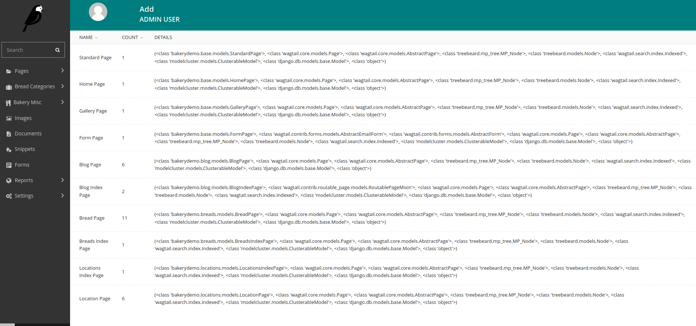

# Wagtail Report

_"Hey, is there anywhere in the admin UI I can see a list of page types with counts?"_

The idea so far is to provide a report of page types with page counts.
So far it's assumed that all your page models extend `wagtail.core.page`, that's probably
not good enough but it's a start.

#### Todos
- [ ] Is it useful for developers to see class inheritance in a dropdown row? Probably not, goes slightly against the publishing focus of the admin interface.
- [ ] Models that aren't page models but are `models.Model`
- [ ] Test
- [ ] Backwards compatability
- [ ] Readme and screenshot update
- [ ] Package up for pypi